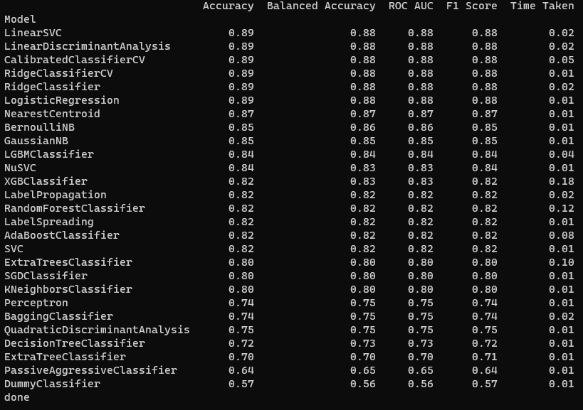
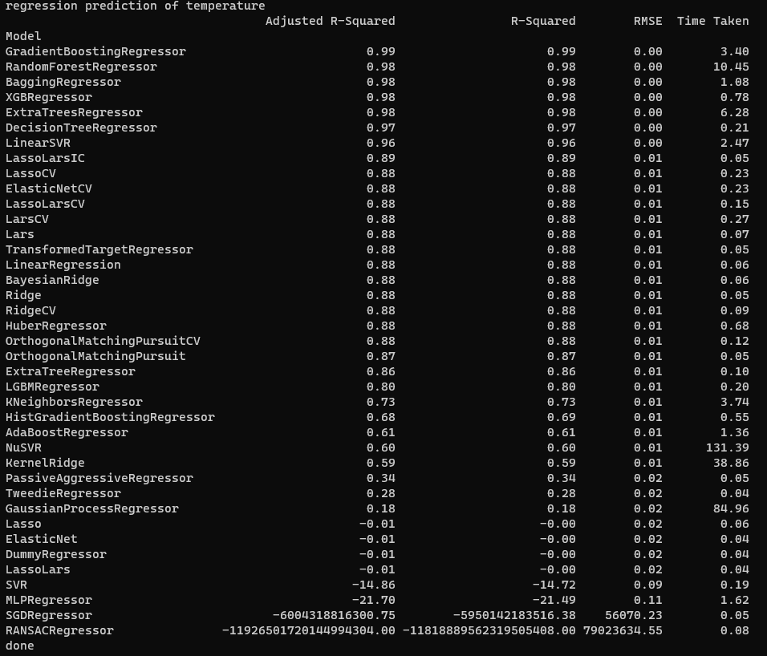
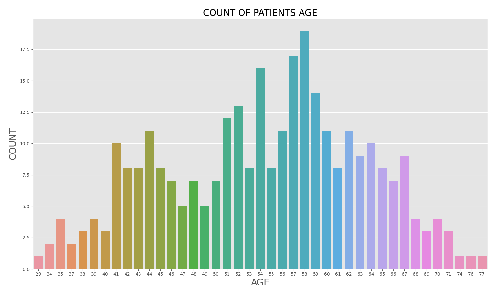
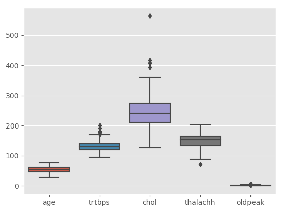
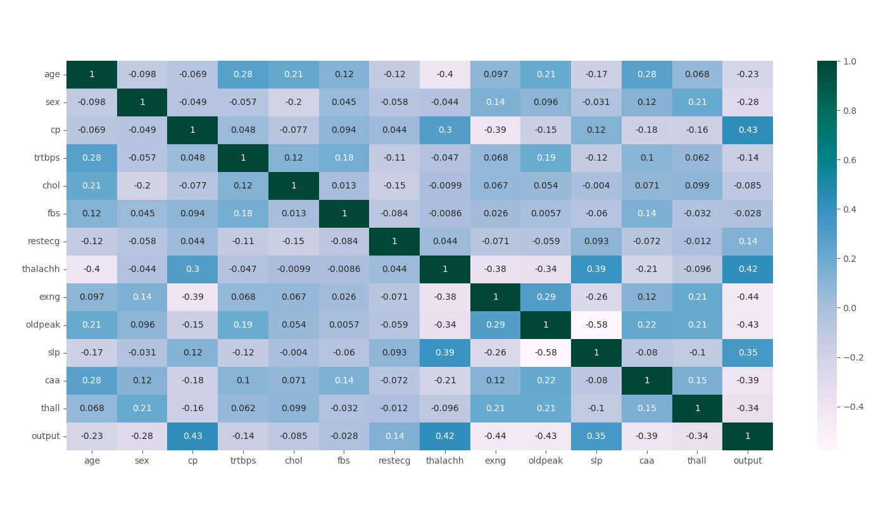
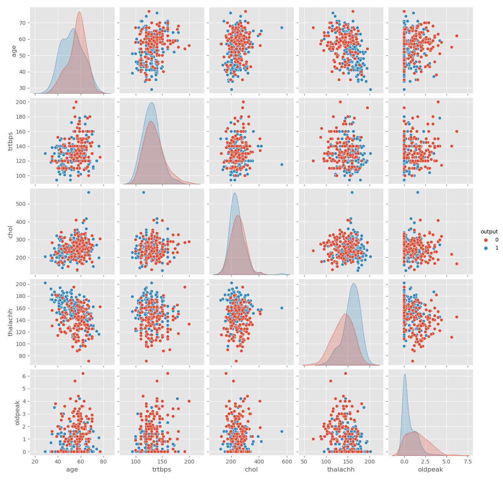

# csv_regression_n_classification

 This repo provide comprehensive solution for searching best suit model for regression and classification using a utility python package called 'lazypredict'. This package produces training result of multiple models so that easy to compare and choose a suit model on givne dataset. Additionally, here I added data visualization to help getting insight of input data. 

## RESULT of MODEL TRAINING
* Classification  
  
 

* Regression  
  
 

## DATA VISUALISATION
(Based on the heart attack dataset)  
  
 

  
 

  
 

  
 

## DEPENDENCY
* python==3.6
* lazypredict==0.2.12
* matplotlib==3.3.4
* numpy==1.19.5
* pandas==1.1.5
* Pillow==8.4.0
* scikit-learn==0.23.1
* scipy==1.5.4
* seaborn==0.11.2

## DATA SOURCE
Classification: https://www.kaggle.com/code/lironb/heart-attack-analysis-prediction   
Regression: https://www.kaggle.com/datasets/muthuj7/weather-dataset

## CODE BASE
https://lazypredict.readthedocs.io/en/latest/usage.html
